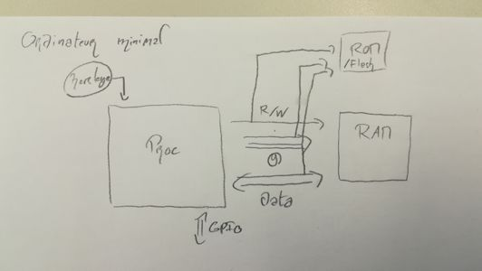
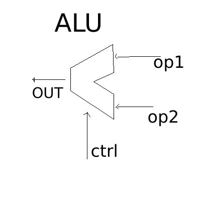

# Cours 1: Programation DLX
 prof: Thierry Grandpierre

## Architecture Load/Store

Un ordinateur “minimal” a besoin:

* D'un Processeur
* D'une RAM
* d'une horloge
* d'une ROM/Flash

L'architecture RISC rend obligatoire de stocker les données à modifier en registre, ce qui fait perdre quelques cycles d'horloges, mais rend ensuite les opérations sur ces valeurs en registres très rapide. C'est l'architecture Load/Store.

L'unité responsable des opérations logiques et arithmétiques est l'ALU (Arithmetic and Logic Unit)
L'ALU a deux entrées de données, une de contrôle (pour le choix de l'opération) et une sortie.

## Les 3 formats d'instruction: I, R, J (taille 32bits)

### Rappels des instructions DLX

1. I: Data Transfert - Accès mémoire
2. R: Arithmétique et logique
3. J: Control
4. (bonus) Floating Point

Les opérations d'accès mémoire et de transferts de données sont par exemple LOAD et STORE

Les opérations Arithmétiques et logiques sont celles relevant de L'ALU

Les opérations de contrôle sont celles permettant de modifier la ligne du code pointée, comme dans un GOTO, un IF ...

Les opérations sur les flottants peuvent être décomposées en plusieures opérations sur les entiers, ce qui les rend plus lentes à traîter.
Elles relève d'une unitée FPU (Float Point Unit) ou de l'ALU s'il n'y en a pas.

Toutes les instructions font 32 bits dans un processeur RISC:

NB: les GPRs sont les sources (les valeurs d'entrées) et le dGPR est le registre de sortie

### I-Format:

| OpCode | sGPR   | dGPR   | immediat |
|:------:|:------:|:------:|:--------:|
| 6 bits | 5 bits | 5 bits | 16 bits  |

ex: lw R1, 16(R0) => |100011|00000|00001|0000000000010000|

### R-Format :

|000000|s1GPR|s2GPR|dGPR|00000|OpCode|
|:----:|:----:|:----:|:----:|:----:|:----:|
|6 bits|5 bits|5 bits|5 bits|5 bits|6 bits|

ex: ADD R1, R2, R3 => |000000|00010|00011|00001|00000|000010|

### J-Format :

|OpCode|Adresse|
|:--:|:--:|
|6 bits| 26 bits|

ex: J +1024 => |111000|00000000000000100000000000|

## 32 registres d'usage général

R0 vaut toujours 0 (ce qui permet de toujours avoir un 0 sous la main)
