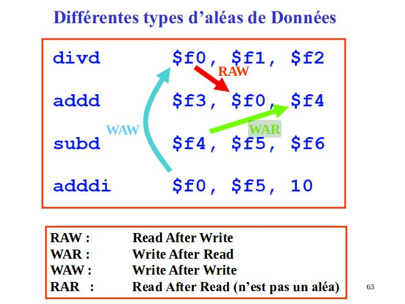

# Aléas

* WAR (write after read)
* RAW (read after write)
* WAW (write after write)

Dans le cas d'une pipeline simple, seules les RAW posent problème.
Solutions:
* chemins de retour (forwarding)
* réordonner les instructions
