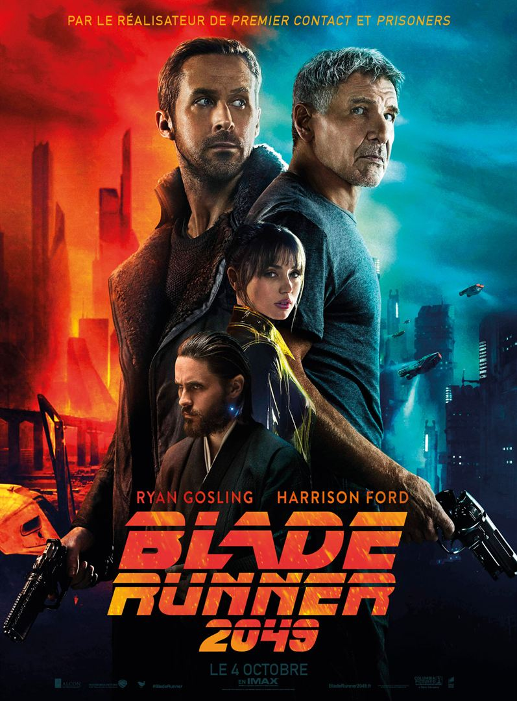
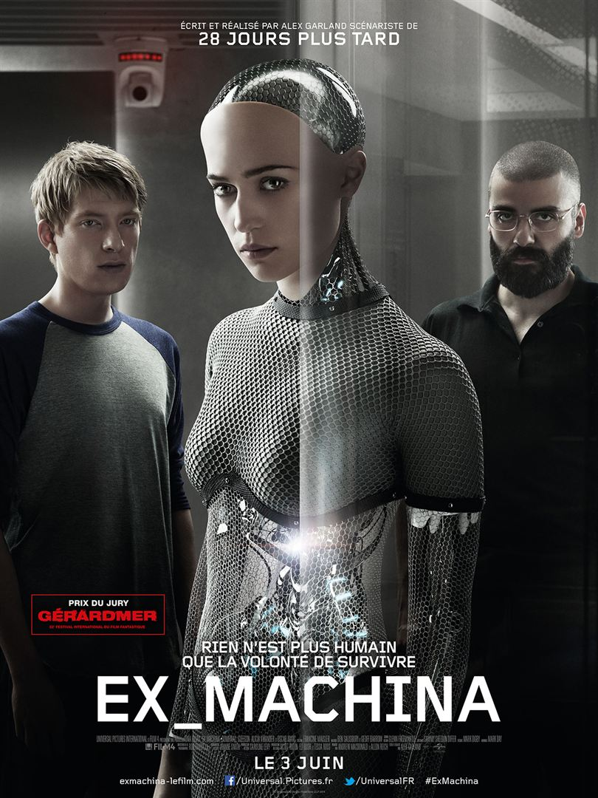
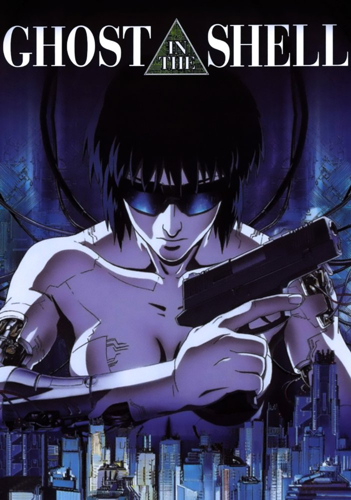
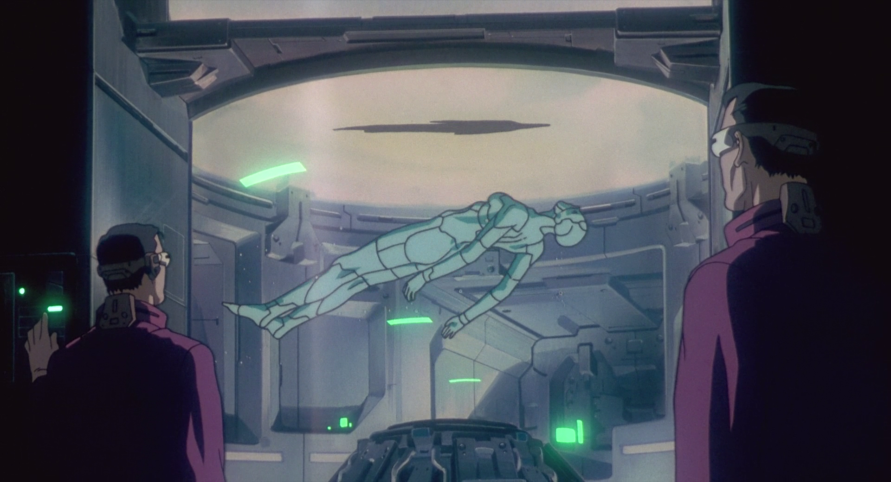
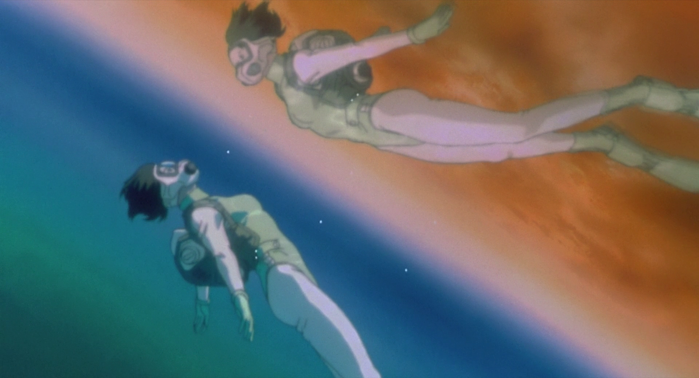
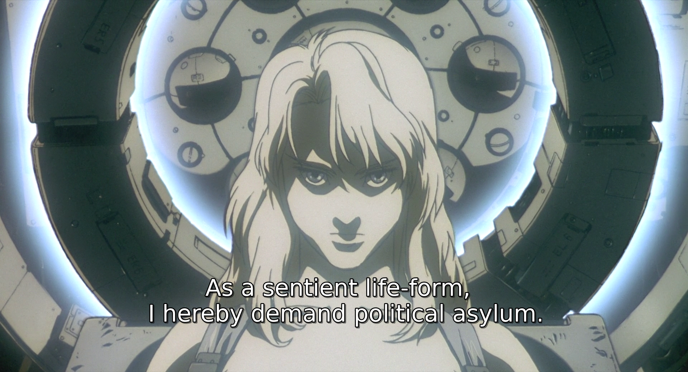

# Ghost in the Shell

## Cyberpunk and post-cyberpunk

### Cyberpunk:
* science is opposed to humanity and controled by the few
* dystopic
* paroxysm of individualism
* the heroes are marginalized and try to find a place out of society





### Post-cyberpunk
* science is globaly neutral
* may be optimistic
* characters are part of society and they don't want to escape it
* talks about the social impact of technology




## The franchise and universe

* Franchise founded by Musamune Shirow
* Near future in Japan
* Everyone is cybernetized
* Concept of “Ghost” to define humanity
* Revolves around section 9

## The 1995 movie



```
characters

Major Motoko Kusanagi

Chief Daisuke Aramaki
Batou
Togusa
```

```
speech:
	Section 9 chase the puppet master, a mysterious hacker implanting false memories in their victimes' ghost
	While doing so, the Major, a full armored cyborg, starts to introspect.
```

### Introduction of the movie

(the extract)

### The plot


In *very* short:

A mysterious hacker - the puppet master - hack peoples ghost in what seems to be terrorist attacks.

The puppet master is actually a spying program that became self-aware.
The hacker wants to reach out to Motoko, so that they could propose her a merge, as they are alike and would complete each other.
And so do they.

### The *real* plot

The real story is the introspection of Motoko.

Several events in the movie makes her revise her status of “human being”.

#### At the begining

Motoko's body is not human

* Motoko is a full cyborg
* She's a tank
* Her body is just a tool

She also behaves deshumanized.

* When she wakes up, she just put a jacket on and leave her crude flat.
* She never blinks, or rarely.
* She's distant and doesn't display her emotions.
* She doesn't look concerned by her body

#### The Simulated experience

(the extract)

* The puppet master is a mysterious hacker
* They hack into the ghost of his victims to change their memories
* The Ghost in itself is then not a proof of origin.
* She freaks out and go diving



* She later have a monologue with Batou

(the extract)

#### The artificial ghost




A ghost (the puppet master) is found in the memory of a brainless cyber body.
Now Motoko starts to fear she might not even be human, but be entierly manufactured, like that ghost.
She decides she absolutly need to find out by herselve by diving into that body, at all cost.

#### The merge

The puppet master propose her to merge, she accepts.
She's not confined anymore, and she is now sure of what she is: neither a human or a machine.


### The tank Scene, a good summary


```
Motoko chases after a cyber-body containing the puppet master's artificial ghost.
(Section 6 kidnaped it with a heavely handed commando operation in section 9 headquarters.)
```

(the extract)


* The Major breaks the stone by landing on it -> inhuman body
* She doesn't hesitate to destroy her body just to try reaching her goal -> no instinct of self-preservation
* It is a confrontation between man and the machine, litteraly, which ends with a status quo -> not a solution
* The genealogic tree -> natural selection (base of the movie)


### A Post Cyberpunk Story

This is clearely a post-cyberpunk story.

* materialistic approach
* optimistic
* deep introspection, philosophy
* science & darwinism


